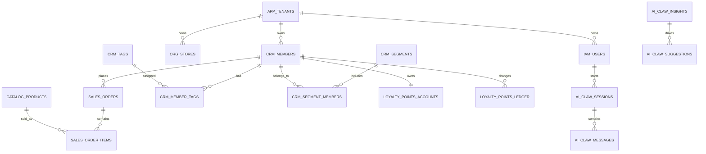

# MySQL 数据库设计与宝塔部署说明

## 目标

为 IS 微智会员 SCRM 原型准备可落地的 MySQL 数据库，覆盖当前七大业务域：

- 微智 Claw
- 用户数据
- 微信管理
- 营销管理
- 忠诚度管理
- 社交 SCRM
- 配置管理（已合并企业管理与开发平台）

## 文件清单

```text
database/mysql/00_bootstrap.sql        # 手动建库、应用用户和只读用户
database/mysql/01_schema.sql           # MySQL 5.7.44+ 兼容的真实业务表、索引、外键
database/mysql/02_seed_demo.sql        # 与当前原型一致的演示数据
deploy/baota/mysql/docker-compose.yml  # 宝塔 Docker Compose 部署 MySQL
deploy/baota/mysql/.env.example        # 环境变量模板
deploy/baota/mysql/README.md           # 上传到宝塔后的最短执行说明
server/api.py                          # 前端读取真实数据的 API 服务
server/.env.example                    # API 数据库连接环境变量模板
server/requirements.txt                # API Python 依赖
```

## 设计说明

MySQL 没有 PostgreSQL 那种单库多 schema 的使用习惯，因此这里采用单库 + 表名前缀。宝塔中已有数据库叫 `crm` 时，可以直接连接 `crm` 执行；新环境也可以按文档创建 `member_crm`。

| 前缀 | 用途 |
| --- | --- |
| `app_` | 租户 |
| `org_` | 组织、门店、员工 |
| `iam_` | 用户、角色、权限 |
| `crm_` | 会员、标签、分群、日志 |
| `catalog_` | 商品 |
| `sales_` | 订单、订单明细、退款 |
| `marketing_` | 活动、优惠券、触达 |
| `loyalty_` | 等级、积分、权益、成长 |
| `wechat_` | 微信账号、会话、消息、社群、朋友圈、自动回复 |
| `scrm_` | 企微客户、客户群、素材、群发任务 |
| `ai_` | 微智 Claw 提示词、问答会话、洞察、建议、动作 |
| `ops_` | 参数、模板、字典、调度、审计 |
| `dev_` | 开放应用、API 文档、接口权限、Webhook、调用日志 |

## 核心关系



## 宝塔部署方案 A：内置 MySQL（推荐）

适合已有宝塔 MySQL 服务，便于使用面板备份、账号管理和安全组配置。

1. 在宝塔软件商店安装 MySQL 5.7.44 或更高版本。
2. 在宝塔数据库面板创建：

```text
数据库：member_crm
用户：member_crm_app
字符集：utf8mb4
```

3. 上传仓库，或把 SQL 文件上传到服务器。
4. 执行 schema 和演示数据：

```bash
mysql -h 127.0.0.1 -u member_crm_app -p member_crm < database/mysql/01_schema.sql
mysql -h 127.0.0.1 -u member_crm_app -p member_crm < database/mysql/02_seed_demo.sql
```

5. 验证：

```bash
mysql -h 127.0.0.1 -u member_crm_app -p member_crm \
  -e "select count(*) as members from crm_members;"
mysql -h 127.0.0.1 -u member_crm_app -p member_crm \
  -e "select count(*) as tables_count from information_schema.tables where table_schema = 'member_crm';"
```

如需只读报表账号，用管理员执行：

```sql
CREATE USER IF NOT EXISTS 'member_crm_readonly'@'%' IDENTIFIED BY 'CHANGE_ME_READONLY_PASSWORD';
GRANT SELECT ON member_crm.* TO 'member_crm_readonly'@'%';
FLUSH PRIVILEGES;
```

## 宝塔部署方案 B：Docker Compose

适合宝塔没有 MySQL，或想把数据库独立在容器里。

1. 在宝塔服务器创建目录：

```bash
mkdir -p /www/server/member-crm-mysql/init
```

2. 上传部署文件：

```bash
scp deploy/baota/mysql/docker-compose.yml root@SERVER:/www/server/member-crm-mysql/docker-compose.yml
scp deploy/baota/mysql/.env.example root@SERVER:/www/server/member-crm-mysql/.env
scp database/mysql/01_schema.sql root@SERVER:/www/server/member-crm-mysql/init/01_schema.sql
scp database/mysql/02_seed_demo.sql root@SERVER:/www/server/member-crm-mysql/init/02_seed_demo.sql
```

3. 在宝塔终端修改密码：

```bash
vim /www/server/member-crm-mysql/.env
```

4. 启动 MySQL：

```bash
cd /www/server/member-crm-mysql
docker compose up -d
docker compose ps
```

5. 验证连接：

```bash
docker exec -it member-crm-mysql mysql -u member_crm_app -p member_crm -e "show tables;"
docker exec -it member-crm-mysql mysql -u member_crm_app -p member_crm -e "select count(*) from crm_members;"
```

## 生产安全建议

- 默认不要开放公网 `3306`，优先让后端 API 通过 `127.0.0.1` 或内网访问。
- `member_crm_app` 用于 API 服务，`member_crm_readonly` 用于报表和 BI。
- 会员手机号只保存 `phone_hash` 和 `phone_mask`，明文手机号应由业务服务加密存储或托管在专门的敏感数据服务中。
- 每日执行 `mysqldump --single-transaction member_crm` 备份，并把备份同步到非本机存储。
- 上线后建议把 `02_seed_demo.sql` 只用于测试环境，生产环境改走正式导入流程。

## 前端真实数据 API

前端不直接连接 MySQL，而是请求 API：

- 数据接口：`GET /api/app-data`
- 健康检查：`GET /api/health`
- 本地默认端口：`127.0.0.1:8787`

宝塔推荐部署方式：

1. 在项目目录创建 `server/.env`，参考 `server/.env.example` 配置 MySQL 连接。
2. 安装 API 依赖：`python3 -m pip install -r server/requirements.txt`。
3. 启动 API：`python3 server/api.py`。
4. 在宝塔站点中把 `/api` 反向代理到 `http://127.0.0.1:8787`。
5. 前端正常构建并部署，页面会从 `/api/app-data` 读取数据库数据。

如果前端部署在 GitHub Pages 这类纯静态环境，需要构建时设置 `VITE_API_BASE_URL=https://你的API域名`，否则静态页面无法访问宝塔内网 API。

## 后端连接串

```text
mysql://member_crm_app:<password>@127.0.0.1:3306/member_crm?charset=utf8mb4&timezone=Asia%2FShanghai
```

如果 API 容器和 MySQL 在同一个 Compose 网络里，可把 host 改为服务名：

```text
mysql://member_crm_app:<password>@member-crm-mysql:3306/member_crm?charset=utf8mb4&timezone=Asia%2FShanghai
```
