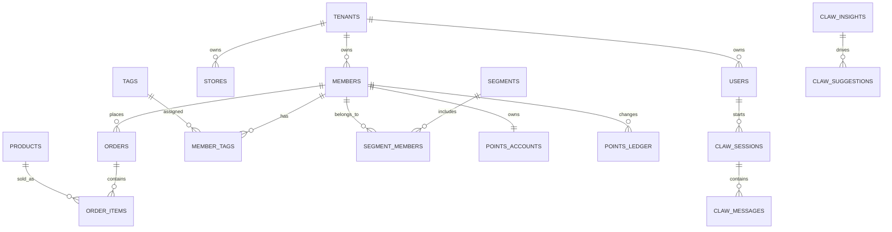

# PostgreSQL 数据库设计与宝塔部署说明

## 目标

为 IS 微智会员 SCRM 原型准备可落地的 PostgreSQL 数据库，覆盖当前七大业务域：

- 微智 Claw
- 用户数据
- 微信管理
- 营销管理
- 忠诚度管理
- 社交 SCRM
- 配置管理（已合并企业管理与开发平台）

## 文件清单

```text
database/postgres/00_bootstrap.sql       # 手动建库和角色，适合已有 PostgreSQL 服务
database/postgres/01_schema.sql          # 真实业务 schema、索引、触发器、权限
database/postgres/02_seed_demo.sql       # 与当前原型一致的演示数据
deploy/baota/postgres/docker-compose.yml # 宝塔 Docker Compose 部署 PostgreSQL
deploy/baota/postgres/.env.example       # 环境变量模板
deploy/baota/postgres/README.md          # 上传到宝塔后的最短执行说明
```

## Schema 分层

| Schema | 用途 |
| --- | --- |
| `app` | 租户、通用函数 |
| `org` | 组织、门店、员工 |
| `iam` | 用户、角色、权限 |
| `crm` | 会员、标签、分群、日志 |
| `catalog` | 商品 |
| `sales` | 订单、订单明细、退款 |
| `marketing` | 活动、优惠券、触达 |
| `loyalty` | 等级、积分、权益、成长 |
| `wechat` | 微信账号、会话、消息、社群、朋友圈、自动回复 |
| `scrm` | 企微客户、客户群、素材、群发任务 |
| `ai` | 微智 Claw 提示词、问答会话、洞察、建议、动作 |
| `ops` | 参数、模板、字典、调度、审计 |
| `dev` | 开放应用、API 文档、接口权限、Webhook、调用日志 |

## 核心关系



## 宝塔部署方案 A：Docker Compose（推荐）

适合宝塔没有 PostgreSQL 插件，或想保持部署方式可复制。

1. 在宝塔服务器创建目录：

```bash
mkdir -p /www/server/member-crm-postgres/init
```

2. 上传部署文件：

```bash
scp deploy/baota/postgres/docker-compose.yml root@SERVER:/www/server/member-crm-postgres/docker-compose.yml
scp deploy/baota/postgres/.env.example root@SERVER:/www/server/member-crm-postgres/.env
scp database/postgres/01_schema.sql root@SERVER:/www/server/member-crm-postgres/init/01_schema.sql
scp database/postgres/02_seed_demo.sql root@SERVER:/www/server/member-crm-postgres/init/02_seed_demo.sql
```

3. 在宝塔终端修改密码：

```bash
vim /www/server/member-crm-postgres/.env
```

4. 启动 PostgreSQL：

```bash
cd /www/server/member-crm-postgres
docker compose up -d
docker compose ps
```

5. 验证连接：

```bash
docker exec -it member-crm-postgres psql -U member_crm_app -d member_crm -c "\dn"
docker exec -it member-crm-postgres psql -U member_crm_app -d member_crm -c "select count(*) from crm.members;"
```

## 宝塔部署方案 B：面板 PostgreSQL 插件

如果你的宝塔软件商店已经有 PostgreSQL 管理器：

1. 在宝塔中安装 PostgreSQL。
2. 创建数据库 `member_crm`，用户 `member_crm_app`，设置强密码。
3. 在数据库管理界面或 SSH 中执行：

```bash
psql -h 127.0.0.1 -U member_crm_app -d member_crm -f database/postgres/01_schema.sql
psql -h 127.0.0.1 -U member_crm_app -d member_crm -f database/postgres/02_seed_demo.sql
```

若希望单独创建只读报表用户，可先用超级用户执行 `00_bootstrap.sql`，或按你的面板能力手动创建 `member_crm_readonly`。

## 生产安全建议

- 默认不要开放公网 `5432`，优先让后端 API 通过 `127.0.0.1` 或内网访问。
- `member_crm_app` 用于 API 服务，`member_crm_readonly` 用于报表和 BI。
- 会员手机号只保存 `phone_hash` 和 `phone_mask`，明文手机号应由业务服务加密存储或托管在专门的敏感数据服务中。
- 每日执行 `pg_dump -Fc member_crm` 备份，并把备份同步到非本机存储。
- 上线后建议把 `02_seed_demo.sql` 只用于测试环境，生产环境改走正式导入流程。

## 后端连接串

```text
postgresql://member_crm_app:<password>@127.0.0.1:5432/member_crm?sslmode=disable
```

如果 API 容器和 PostgreSQL 在同一个 Compose 网络里，可把 host 改为服务名：

```text
postgresql://member_crm_app:<password>@member-crm-postgres:5432/member_crm?sslmode=disable
```
